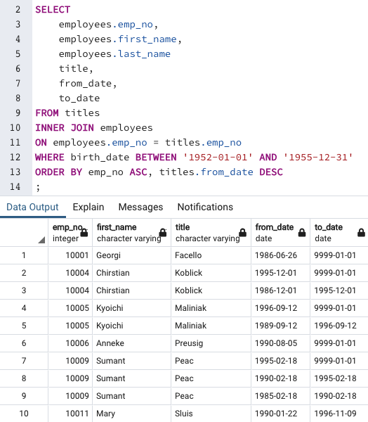
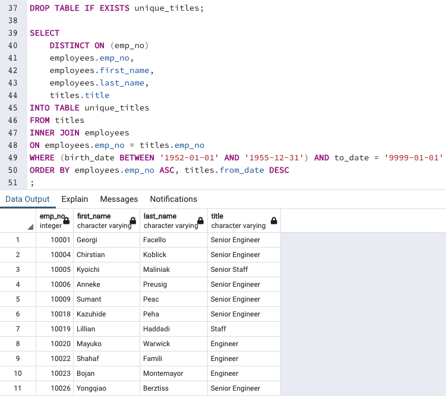
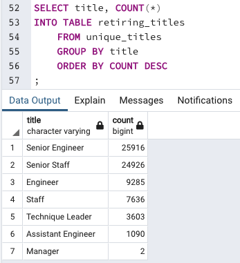
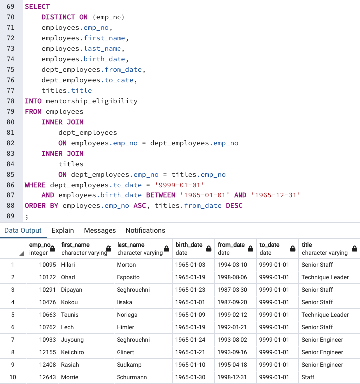
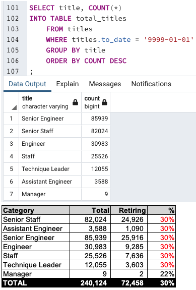
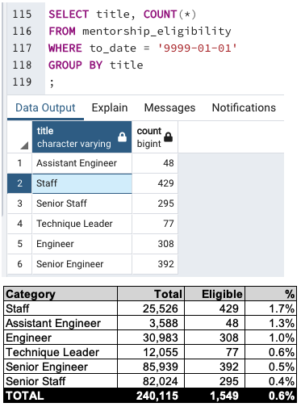

# Pewlett-Hackard Analysis

Pewlett-Hackard provided its personnel information, and is interested in some analysis, in this exercise, we will determine:

* the number of retiring employees per title, and
* the employees who are eligible to participate in a mentorship program

This will be done using pgAdmin 4's capabilities:
* JOIN
* ORDER BY
* COUNT
* DISTINCT ON, among others

## Deliverable 1

1.1 Query to create a "Retirement Titles" table for employees who are born between January 1, 1952 and December 31, 1955.

1.2 Retirement Titles table exported as "retirement_titles.csv".

​1.3 Query to create a Unique Titles table that contains the employee number, first and last name, and most recent title.

​1.4 Unique Titles table exported as "unique_titles.csv".

1.5 Query to create a Retiring Titles table that contains the number of titles filled by employees who are retiring.

1.6 The Retiring Titles table is exported as "retiring_titles.csv".

## Deliverable 2

2.1 Query to create a Mentorship Eligibility table for current employees who were born between January 1, 1965 and December 31, 1965.

2.2 Mentorship Eligibility table exported and saved as "mentorship_eligibilty.csv".

## Analysis Overview

Using Pewlett-Hackard personnel information, the following were determined:

* the number of retiring employees per title
* the employees who are eligible to participate in a mentorship program

## Results

The following two calculations: "eligible retirees" and "possible mentors", were done using the total current amount of employees: 240,124.

### Retiring employees:

* In each category, 30% of the workforce is eligible for retirement (except Managers with 22%)
* In total, 72,458 employees are eligible, which is 30% of the total workforce

### Mentorship program:

* In three categories (Staff, Assistant Engineer and Engineer), the employees born in 1965 as possible mentors account for just above 1% of each group's population.
* In the remaining three categories, the percentage is less than 1%.
* 0.6% when totalizing this metric for the whole Pewlett-Hackard company.

## Summary

The first query gave the number of employees eligible for retirement (per job title). For a more detailed analysis, the percentages were calculated. This metric allowed to realize that 30% of the employees are eligible for retirement (almost across the board).

From the mentorship query, just knowing who is eligible it not a very useful. The data was further grouped by job title, and then the percentages calculated (as above). This showed that in average 0.6% of employees born in 1965 are possible mentors, three categories above 1% and the other three under 1%.